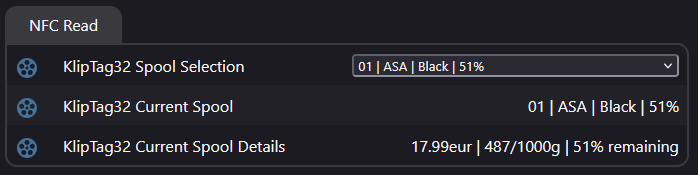
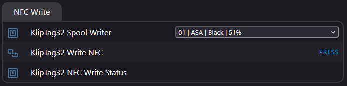
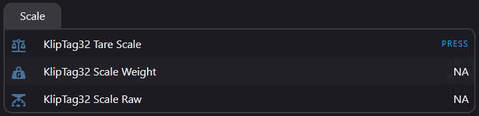
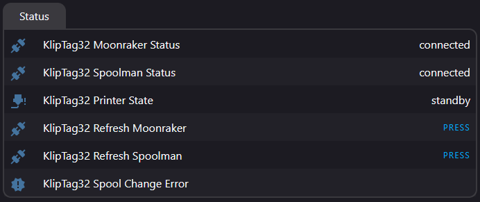
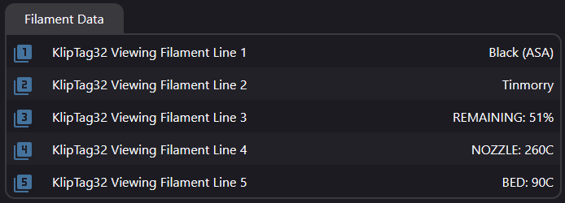

<h1 align="center">KlipTag32</h1>

KlipTag32 is an ESPHome device designed to manage 3D printing filament spools.
It features an OLED display for menu navigation, an NFC reader for tagging and identifying spools, and a load-cell scale for spool weight tracking.







## Features
- **NFC Integration:** Read NDEF data from NFC tags on spools to automatically fetch spool info, or write spool data to new tags.
- **Spoolman/Moonraker Integration:** Directly fetch spool lists, update active spool status, and view filament specifications.
- **On-Device UI:** Navigate through menus using a rotary encoder and buttons to manage spools without needing a browser.

## Hardware Requirements
- **Microcontroller:** ESP32 (ESP32-DevKit recommended)
- **NFC Reader:** RC522 RFID Module
- **Display:** SSD1306/SH1106 OLED (128x64, I2C)
- **Inputs:**
      - 1x Rotary Encoder (with switch)
      - 2x Tactile Push Buttons (Back, Home)
- **Scale:** HX711 with a load cell

## Wiring

| Component       | Function    | ESP32   |
| :-------------- | :---------  | :------ |
| **RC522 (SPI)** | CLK         | GPIO18  |
|                 | MOSI        | GPIO23  |
|                 | MISO        | GPIO19  |
|                 | CS          | GPIO5   |
|                 | Reset       | GPIO4   |
| **OLED (I2C)**  | SDA         | GPIO21  |
|                 | SCL         | GPIO22  |
| **Inputs**      | Encoder A   | GPIO33  |
|                 | Encoder B   | GPIO32  |
|                 | Menu Click  | GPIO25  |
|                 | Menu Back   | GPIO26  |
|                 | Menu Home   | GPIO13  |
| **Scale**       | Data (DOUT) | GPIO36  |
|                 | Clock       | GPIO27  |

## Flashing the firmware
- **Secrets:** Ensure your `secrets.yaml` contains:
```
wifi_ssid: ""
wifi_password: ""
api_key: ""
ota_password: ""
spoolman_ip: "IP:7912"
moonraker_ip: "IP:7125"
kliptag32_area: ""
```

- **Dependencies:** The project uses local components for the RC522 reader (`./kliptag32/`). Ensure these files are placed correctly in your ESPHome filesystem.
